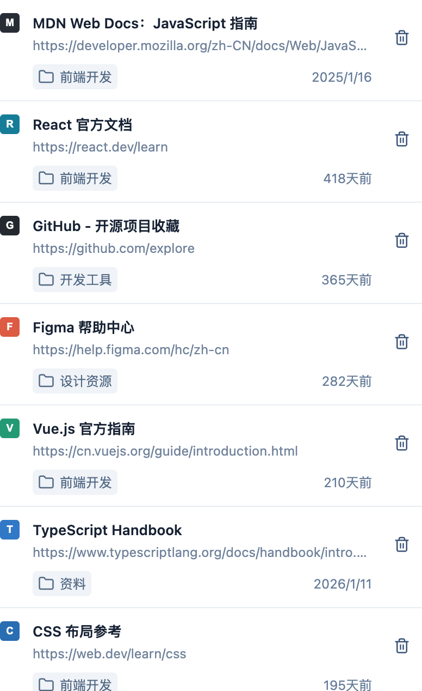

# 收藏夹考古助手

找回那些被遗忘的好网站，也让不再需要的书签离开收藏夹。

这是一个 Chrome 侧边栏插件。它根据网页的**最近访问时间**找出长期未访问的书签，方便你逐条查看、重新打开或直接删除。判断依据不是“已经收藏了多少天”。


> 图片使用演示书签生成，不包含真实用户的收藏夹数据。

## 可以做什么

- **按未访问天数筛选：**默认 180 天，可以在侧边栏顶部修改，点击“筛选”后刷新结果。
- **查看书签信息：**显示网站图标、标题、网址、所在文件夹的最后一级，以及最近访问时间；鼠标停留在文件夹或时间上可以查看更完整的信息。
- **重新打开网站：**点击书签标题或网址，会在新标签页打开对应网站。
- **清理书签：**点击右侧垃圾桶，会直接从 Chrome 收藏夹删除该书签，列表数量随之更新。



> 有浏览历史时显示“多少天前”；没有可用浏览历史时显示收藏日期（若日期可用）。没有浏览历史不等于确定从未访问。

## 安装

目前通过本地加载的方式使用，需要安装 Chrome、Node.js 和 pnpm。

1. 在终端进入本仓库的 `main` 目录，执行：

   ```bash
   pnpm install
   pnpm build
   ```

2. 在 Chrome 地址栏打开 `chrome://extensions`。
3. 开启右上角的“开发者模式”，点击“加载已解压的扩展程序”。
4. 选择 `main/dist` 文件夹。安装后可以在扩展程序菜单中找到“收藏夹考古助手”。

后续更新代码时，重新执行 `pnpm build`，再到扩展程序页面点击该插件的刷新按钮。

## 使用

1. 点击浏览器工具栏中的插件图标，打开右侧侧边栏。
2. 查看清单；默认展示最近 **180 天以上未访问**，以及没有可用访问记录的书签。
3. 想调整范围时，输入大于 0 的整数天数，点击“筛选”。设置保存在本机，重新打开侧边栏仍会生效。
4. 点击标题或网址重新访问网站；确认不再需要的书签，点击垃圾桶删除。
